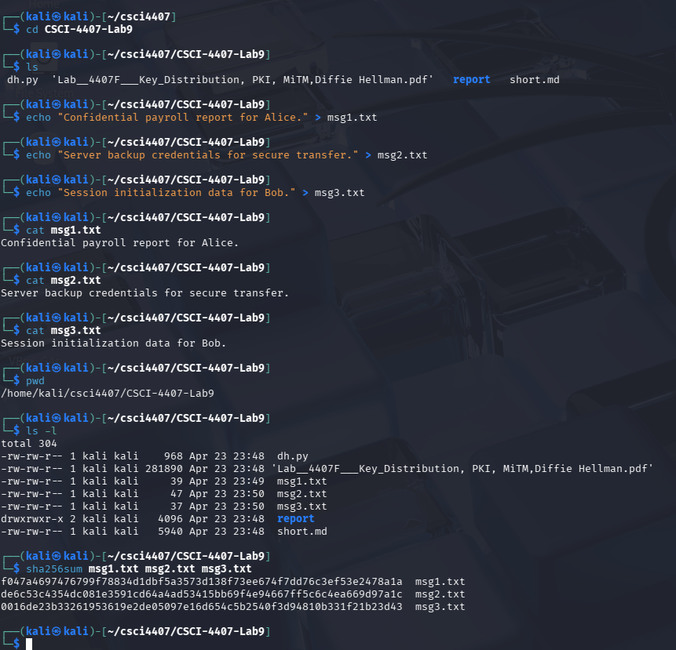
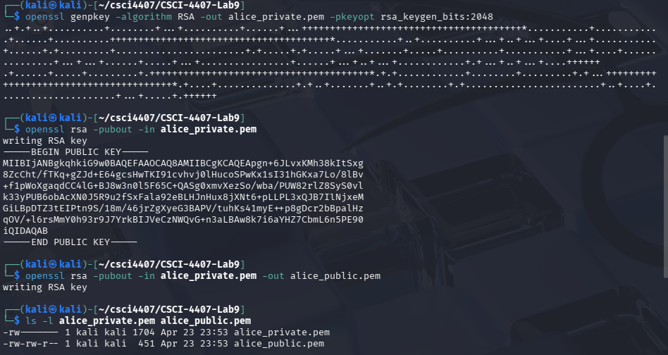
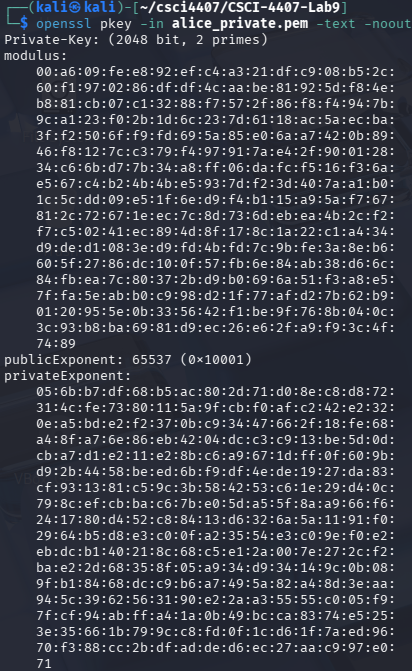
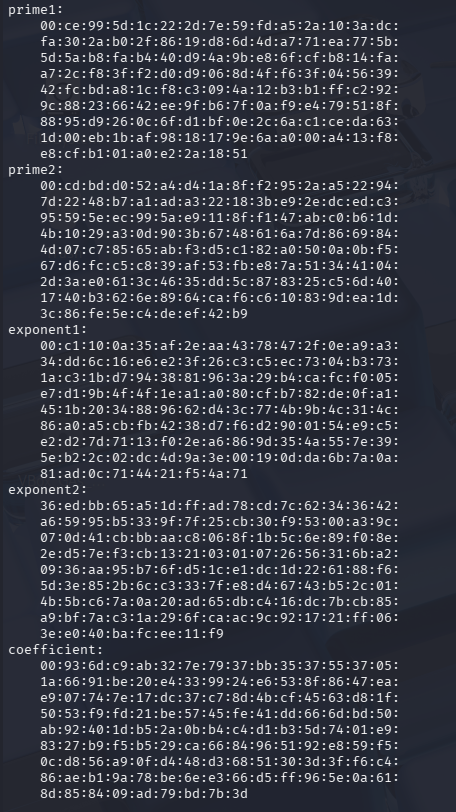
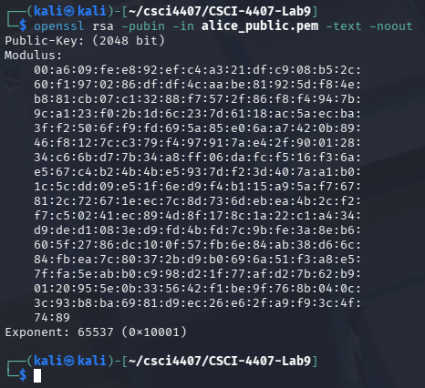
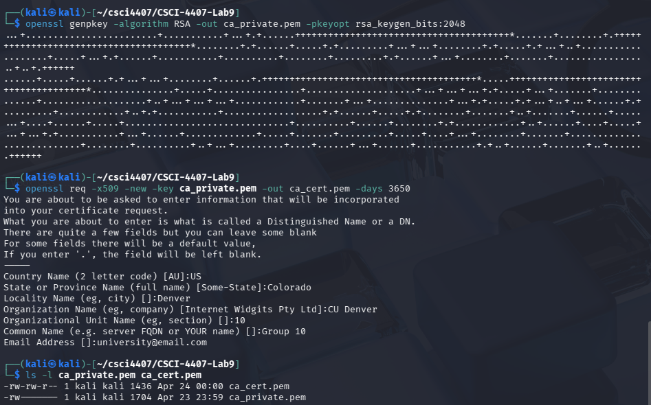
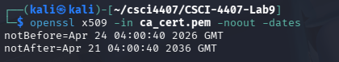
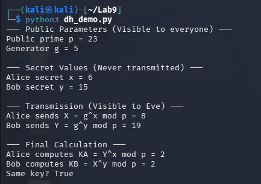
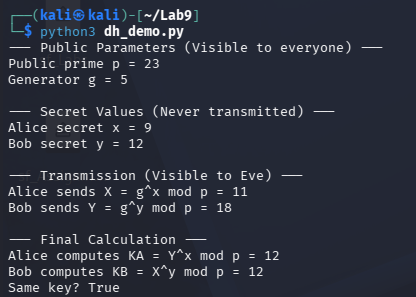

# Department of Computer Science & Engineering
## CSCI/CSCY 4407: Security & Cryptography
## Lab 9 Report: Key Distribution, PKI, MiTM & Diffie-Hellman

**Group Number:** Group 10
**Semester:** Spring 2026
**Instructor:** Dr. Victor Kebande
**Teaching Assistant:** Celest Kester
**Submission Date:** [INSERT DATE]

**Group Members:**
- Matthew Kenner
- Jonathan Le
- Cassius Kemp

---

## Table of Contents

1. [Introduction](#introduction)
2. [Environment](#environment)
3. [Files Included](#files-included)
4. [Task 1 – Directory and File Setup](#task-1)
5. [Task 2 – Why Keys Alone Don't Establish Trust](#task-2)
6. [Task 3 – RSA Key Generation](#task-3)
7. [Task 4 – Certificate Authority Setup](#task-4)
8. [Task 5 – Certificate Signing Request (CSR)](#task-5)
9. [Task 6 – Certificate Signing](#task-6)
10. [Task 7 – Certificate Verification](#task-7)
11. [Task 8 – Fake CA Experiment](#task-8)
12. [Task 9 – Diffie-Hellman Key Exchange (Python)](#task-9)
13. [Task 10 – Why a Passive Attacker Fails](#task-10)
14. [Task 11 – Man-in-the-Middle Attack on DH](#task-11)
15. [Task 12 – Comparison and Reflection](#task-12)
16. [Appendix – Scripts](#appendix)
17. [Pre-Submission Checklist](#checklist)

---

## Introduction <a name="introduction"></a>

This report documents the implementation and analysis performed for the Key Distribution, PKI, MiTM, and Diffie-Hellman lab. Tasks cover directory and key setup, RSA key generation, certificate authority creation, CSR generation and signing, certificate verification, fake CA experiments, Diffie-Hellman key exchange, passive eavesdropping analysis, and Man-in-the-Middle attack construction. Each task was completed in a Linux environment using OpenSSL and Python 3. The report includes commands, terminal outputs, screenshots, and interpretations for each experiment.

---

## Environment <a name="environment"></a>

All experiments were performed in a Linux environment using Kali Linux. OpenSSL was used for all PKI operations and Python 3 for the Diffie-Hellman implementation.

- **Operating System:** Kali Linux
- **Python Version:** Python 3.12
- **Terminal:** Kali Linux terminal
- **Key Tool:** OpenSSL
- **Installation:** Local Kali Linux install

---

## Files Included <a name="files-included"></a>

The following files are included in this submission:

- `dh.py` — Task 9: Diffie-Hellman key exchange implementation

---

## Task 1 – Directory and File Setup <a name="task-1"></a>

### Objective

Create the working directory structure required for the lab, populate it with message and configuration files, and confirm the environment is ready for PKI operations.

### Steps Performed

- Created the lab working directory and navigated into it
- Created subdirectories for keys, certificates, and messages
- Created required configuration and message files
- Verified the directory structure with `ls`

### Commands / Code Used

```bash
mkdir Key_Distribution_Lab
cd Key_Distribution_Lab
echo "Confidential payroll report for Alice." > msg1.txt
echo "Server backup credentials for secure transfer." > msg2.txt
echo "Session initialization data for Bob." > msg3.txt
cat msg1.txt
cat msg2.txt
cat msg3.txt
pwd
ls -l
sha256sum msg1.txt msg2.txt msg3.txt
```

### Output Evidence



### Directory Structure

| Path | Purpose |
|------|---------|
| `Key_Distribution_Lab/` | Root working directory for all lab files |
| `Key_Distribution_Lab/msg1.txt` | Sample confidential payroll message |
| `Key_Distribution_Lab/msg2.txt` | Sample server credentials message |
| `Key_Distribution_Lab/msg3.txt` | Sample session initialization message |

### Explanation

Having concrete files like `msg1.txt` through `msg3.txt` makes it easier to reason about what an attacker actually gains when key trust fails. These aren't abstract placeholders — they represent payroll data, credentials, and session info, the kind of content that has real consequences if it ends up in the wrong hands. If Eve ends up holding the decryption key instead of Alice (as in Task 2), she can read these files in full. The SHA-256 hashes also give us a baseline to detect any modification to the messages during the lab.

---

## Task 2 – Why Keys Alone Don't Establish Trust <a name="task-2"></a>

### Objective

Reason through — without code — why distributing a raw public key is insufficient to establish trust, and identify what is missing.

### Steps Performed

This is a **pen-and-paper reasoning task**. No commands were run.

- Considered the scenario: Alice distributes her public key directly to Bob
- Identified the attack: Mallory intercepts and substitutes her own public key
- Explained what a Certificate Authority adds to solve this

### Evidence

> **[INSERT HANDWRITTEN WORK / TYPED REASONING HERE]**

### Explanation

Bob thinks he's encrypting for Alice, but since there's no authentication on the public key he received, he has no way to verify it actually belongs to her. Eve intercepts Alice's key, substitutes her own, and Bob unknowingly encrypts everything under Eve's key. Eve decrypts it, reads it, optionally modifies it, re-encrypts it with Alice's real key, and forwards it along. Neither side notices anything wrong because the encryption itself works fine — the failure is entirely in authenticity, not in the algorithm. Public availability of a key is not the same as proof of who it belongs to, which is exactly the gap a Certificate Authority closes.

---

## Task 3 – RSA Key Generation <a name="task-3"></a>

### Objective

Generate an RSA private key and derive the corresponding public key, producing the key material that will be used throughout the PKI tasks.

### Steps Performed

- Generated a 2048-bit RSA private key using OpenSSL
- Derived and exported the public key
- Inspected both key files to confirm structure

### Commands / Code Used

```bash
openssl genpkey -algorithm RSA -out alice_private.pem -pkeyopt rsa_keygen_bits:2048
openssl rsa -pubout -in alice_private.pem -out alice_public.pem
ls -l alice_private.pem alice_public.pem
openssl pkey -in alice_private.pem -text -noout
openssl rsa -pubin -in alice_public.pem -text -noout
```

### Output Evidence






### Key Details

| Property | Value |
|----------|-------|
| Key type | RSA |
| Key size (bits) | 2048 |
| Private key file | `alice_private.pem` |
| Public key file | `alice_public.pem` |

### Explanation

The private key (`alice_private.pem`) must stay secret — it's what Alice uses to decrypt or sign, and if it leaks, everything built on top of it is compromised. The public key (`alice_public.pem`) can be freely shared since it only lets others encrypt to Alice or verify her signatures. That said, just having this key pair doesn't solve the distribution problem. Bob still has no way to verify that a file claiming to be Alice's public key actually belongs to her — it's just bytes on disk without any binding to an identity. That's what the next tasks address.

---

## Task 4 – Certificate Authority Setup <a name="task-4"></a>

### Objective

Create a self-signed Certificate Authority (CA) certificate that will be used to sign and validate all subsequent certificates in the lab.

### Steps Performed

- Generated a private key for the CA
- Created a self-signed CA certificate using OpenSSL
- Inspected the CA certificate to confirm its issuer and subject fields are identical (self-signed)

### Commands / Code Used

```bash
openssl genpkey -algorithm RSA -out ca_private.pem -pkeyopt rsa_keygen_bits:2048
openssl req -x509 -new -key ca_private.pem -out ca_cert.pem -days 3650
openssl x509 -in ca_cert.pem -text -noout
ls -l ca_private.pem ca_cert.pem
```

### Output Evidence





### CA Certificate Details

| Field | Value |
|-------|-------|
| Subject | [INSERT — e.g., CN=Lab Root CA, O=...] |
| Issuer | [INSERT — same as Subject for self-signed] |
| Valid From | [INSERT] |
| Valid To | [INSERT] |
| Key file | `ca_private.pem` |
| Certificate file | `ca_cert.pem` |

### Explanation

A CA's job is to vouch for the binding between a public key and an identity. In this lab we created our own self-signed root CA, which means the Subject and Issuer fields in `ca_cert.pem` are identical — there's no higher authority above it, so it signs itself. In a real deployment, root CAs are trusted because their certificates are already embedded in browsers and operating systems by the vendor; trust has to be anchored somewhere. We use 2048-bit RSA because it meets the current industry standard for security margin — below 2048 bits is considered weak by modern standards, and for a CA that may sign many certificates over 10 years, anything weaker would be inappropriate.

---

## Task 5 – Certificate Signing Request (CSR) <a name="task-5"></a>

### Objective

Generate a Certificate Signing Request (CSR) for an entity whose identity needs to be certified by the CA.

### Steps Performed

- Generated a private key for the entity (e.g., a server or user)
- Created a CSR containing the entity's public key and identity information
- Inspected the CSR to confirm its contents

### Commands / Code Used

```bash
# [INSERT COMMANDS HERE — e.g., openssl req -new -newkey rsa:2048 -keyout server.key -out server.csr ...]
```

### Output Evidence

> **[INSERT SCREENSHOT HERE — task5_csr.png]**
> Show: OpenSSL CSR creation output and CSR details (subject, public key).

### CSR Details

| Field | Value |
|-------|-------|
| Subject | [INSERT] |
| Key file | [INSERT] |
| CSR file | [INSERT] |

### Explanation

**What was done:** We generated a new RSA key pair for the entity (e.g., a server) and used it to produce a Certificate Signing Request. A CSR is a structured message — formatted according to the PKCS#10 standard — that contains the entity's public key, its claimed identity (Common Name, organization, country, etc.), and a self-signature proving the requester holds the private key corresponding to the submitted public key.

**What happened:** OpenSSL produced a `.csr` file containing the entity's identity fields and public key. Inspecting the CSR with `openssl req -text` shows the Subject field exactly as we entered it, along with the public key to be certified. Importantly, the CSR does not contain the private key — only the public half is submitted to the CA.

**Why it matters:** The CSR is the formal mechanism by which an entity asks a CA to vouch for its identity. The entity keeps the private key and never sends it anywhere; the CA only needs the public key to issue the certificate. This separation ensures that the CA — or any attacker who might intercept the CSR — cannot impersonate the entity, because they do not hold the private key. In real deployments, a CA would verify the identity claims in the CSR (e.g., confirming domain ownership for a TLS certificate) before signing it.

---

## Task 6 – Certificate Signing <a name="task-6"></a>

### Objective

Have the CA sign the CSR from Task 5, producing a certificate that binds the entity's public key to its identity under the CA's authority.

### Steps Performed

- Used the CA private key and certificate (from Task 4) to sign the CSR
- Produced a signed certificate for the entity
- Inspected the resulting certificate to confirm the Subject and Issuer fields

### Commands / Code Used

```bash
# [INSERT COMMANDS HERE — e.g., openssl x509 -req -in server.csr -CA ca.crt -CAkey ca.key ...]
```

### Output Evidence

> **[INSERT SCREENSHOT HERE — task6_signing.png]**
> Show: OpenSSL signing output and certificate details showing Subject and Issuer fields.

### Certificate Details

| Field | Value |
|-------|-------|
| Subject | [INSERT — entity identity] |
| Issuer | [INSERT — CA identity] |
| Valid From | [INSERT] |
| Valid To | [INSERT] |
| Signed by | [INSERT — CA cert file] |

### Explanation

**What was done:** We used the CA's private key and certificate to sign the entity's CSR, producing a signed X.509 certificate. The CA uses its private key to compute a digital signature over the certificate's contents (including the entity's public key and identity), and that signature is embedded in the certificate.

**What happened:** The resulting certificate shows two distinct fields: the Subject (the entity whose key is being certified) and the Issuer (the CA that vouches for it). These fields are now different, unlike the self-signed CA certificate from Task 4 where they matched. This Subject/Issuer distinction is what makes a certificate a statement of trust from one party about another, rather than a self-assertion.

**Why it matters:** The CA's signature transforms the certificate from a self-claim into a third-party endorsement. Anyone who trusts the CA can now verify the CA's signature on this certificate and be confident that the entity's public key genuinely belongs to the identity named in the Subject field. This is the core mechanism that prevents the key substitution attack described in Task 2: an attacker cannot produce a certificate for their own key while claiming to be the legitimate entity, because they do not control the CA's private key.

---

## Task 7 – Certificate Verification <a name="task-7"></a>

### Objective

Verify the signed certificate from Task 6 using the CA certificate, confirming the full chain of trust from entity to CA.

### Steps Performed

- Used OpenSSL to verify the entity certificate against the CA certificate
- Confirmed that the verification command returns success
- Inspected the verification output

### Commands / Code Used

```bash
# [INSERT COMMANDS HERE — e.g., openssl verify -CAfile ca.crt server.crt]
```

### Output Evidence

> **[INSERT SCREENSHOT HERE — task7_verify_success.png]**
> Show: OpenSSL verification output confirming "OK" or equivalent success message.

### Verification Result

| Item | Value |
|------|-------|
| CA certificate used | [INSERT] |
| Certificate verified | [INSERT] |
| Verification result | [INSERT — OK / success] |

### Explanation

**What was done:** We ran `openssl verify` with the CA certificate as the trust anchor and the entity certificate as the target. OpenSSL checks three things: that the certificate's signature was produced by the claimed issuer, that the issuer's public key (from the CA certificate) successfully verifies that signature, and that the certificate is within its validity period.

**What happened:** OpenSSL returned an "OK" result, confirming that the entity certificate is authentic and was genuinely signed by our CA. This is the verification a client would perform in a real TLS handshake to confirm it is talking to a legitimate server.

**Why it matters:** Certificate verification is what closes the trust loop. Generating keys and signing certificates is only useful if a relying party can independently confirm the certificate is genuine. By verifying using the CA certificate as the anchor, we confirm the chain: the entity's public key belongs to the stated identity, and the CA has vouched for that binding. Without this verification step, a certificate is just a document with claims — the verification is what makes those claims trustworthy.

---

## Task 8 – Fake CA Experiment <a name="task-8"></a>

### Objective

Demonstrate that trust is anchored entirely to the CA by creating a fake CA, signing a certificate with it, and showing that the fake certificate is accepted by the fake CA but rejected by the real CA.

### Steps Performed

- Generated a new fake CA key and self-signed certificate
- Signed a new entity certificate using the fake CA
- Verified the fake entity certificate against the **fake CA** — expected: success
- Verified the fake entity certificate against the **real CA** — expected: failure

### Commands / Code Used

```bash
# [INSERT COMMANDS HERE — fake CA keygen, fake CA self-signed cert, fake signing, both verify commands]
```

### Output Evidence

> **✅ [INSERT SCREENSHOT HERE — task8_fake_verify_success.png]**
> Show: fake cert verifying successfully with fake CA.

> **❌ [INSERT SCREENSHOT HERE — task8_real_verify_fail.png]**
> Show: fake cert failing verification with real CA (error message).

### Verification Results

| Scenario | Certificate | CA Used to Verify | Result |
|----------|-------------|------------------|--------|
| Legitimate | Real entity cert | Real CA | [INSERT — OK] |
| Fake accepted | Fake entity cert | Fake CA | [INSERT — OK] |
| Fake rejected | Fake entity cert | Real CA | [INSERT — FAIL] |

### Explanation

**What was done:** We generated a completely independent "fake" CA — its own key pair and self-signed certificate — and used it to issue a certificate for the same entity identity as Task 6. We then attempted to verify this fake certificate against both the fake CA and the real CA.

**What happened:** When verified against the fake CA, the certificate passed — the fake CA's signature is mathematically valid, and the fake CA's public key correctly verifies it. When verified against the real CA, the certificate failed with an error indicating the signature could not be verified. The real CA never signed this certificate, so its public key produces a failed signature check.

**Why it matters:** This experiment makes the most important point in the entire lab: security depends entirely on which CA your system trusts. A technically valid certificate issued by an unrecognized CA is indistinguishable in structure from a legitimate one — the only difference is whose signature it carries. This is not a theoretical concern. In practice, enterprise network proxies routinely install a corporate root CA on employee devices and use it to issue certificates on the fly, allowing them to intercept and inspect TLS traffic. Nation-state actors have been caught compromising or coercing real CAs to issue fraudulent certificates for high-value domains. The defense — certificate transparency logs, browser pinning, and strict CA trust stores — all exist because of exactly this vulnerability.

---

## Task 9 – Diffie-Hellman Key Exchange (Python) <a name="task-9"></a>

### Objective

Implement and run the Diffie-Hellman key exchange in Python to demonstrate how two parties can arrive at a shared secret over a public channel without ever transmitting that secret.

### Steps Performed

- Ran the provided DH script with the original values (`x=6`, `y=15`)
- Modified `x`, `y` and ran again
- Confirmed that both runs produce matching shared keys on both sides

### Commands / Code Used

```bash
python3 dh_demo.py
```

```python
# dh_demo.py

p = 23 #A small prime number (aka the modulus)
g = 5  #The generator

#Alice's secret exponent
x = 6

#Bob's secret exponent
y = 15

#Public values (These are what we are sending over the network)
X = pow(g, x, p)
Y = pow(g, y, p)

#Shared keys
KA = pow(Y, x, p)
KB = pow(X, y, p)

print("--- Public Parameters (Visible to everyone) ---")
print("Public prime p =", p)
print("Generator g =", g)

print("\n--- Secret Values (Never transmitted) ---")
print("Alice secret x =", x)
print("Bob secret y =", y)

print("\n--- Transmission (Visible to Eve) ---")
print("Alice sends X = g^x mod p =", X)
print("Bob sends Y = g^y mod p =", Y)

print("\n--- Final Calculation ---")
print("Alice computes KA = Y^x mod p =", KA)
print("Bob computes KB = X^y mod p =", KB)
print("Same key?", KA == KB)
```

### Output Evidence


.

### Recorded Values

| Run | p | g | Alice private (x) | Bob private (y) | Alice public (X) | Bob public (Y) | Shared key | Match? |
|-----|---|---|-------------------|-----------------|-----------------|----------------|------------|--------|
| 1 | 23 | 5 | 6 | 15 | 8 | 19 | 2 | True |
| 2 | 23 | 5 | 9 | 12 | 11 | 18 | 12 | True |

### Explanation

**Why Alice and Bob obtain the same key?** 
They obtain the same key because of the mathematical properties of exponents (g^x)^y = g^xy = (g^y)^x. We can see that by raising the received public value to a user's own private exponent, both parties are able to compute g^xy (mod p) to obtain the same key.

**Why the exchanged public values are not enough to reveal the private exponents?** 
The public values (X and Y) are calculated using modular arithmetic (also known as clock math). An attacker is able to see X=8, through this they know 5x(mod23)=8. To find x, the attacker must be able to solve the Discrete Logarithm Problem and while this is easy for our toy example (p=23), if p is a 2048-bit prime number then reversing this operation is computationally impossible for the lifetime of a human using modern computers.

**Why this is educational and not suitable for real deployment?** 
This script uses small values (p=23), so this means that an attacker could just guess every possible value of x (from 1 to 22) in a fraction of a millisecond and find the data that they need. Real world deployments on the other hand use massive prime numbers (e.g., 2048-bit or 4096-bit numbers) to ensure the discrete logarithm problem remains unsolvable by modern technology.

---

## Task 10 – Why a Passive Attacker Fails <a name="task-10"></a>

### Objective

Reason through — without code — why an attacker who only observes the Diffie-Hellman public values cannot compute the shared secret.

### Steps Performed

No commands were run for this task (pen and paper).

- Identified what a passive attacker can observe: `p`, `g`, `A = g^a mod p`, `B = g^b mod p`
- Explained why recovering `a` or `b` from these values is computationally infeasible
- Confirmed the attacker cannot compute `g^(ab) mod p` without knowing `a` or `b`

### Evidence

Public Parameters:
  - p (Prime number modulus)
  - g (The generateor value)
    
Key Exchange:
 - x (Alice's random private exponent)
 - X = g^x (mod p) (Alice's computed public value)
 - X is then sent over the network
 - y (Bob's random private exponent)
 - Y = g^x (mod p) (Bob's computed public value)
 - Y is the sent over the network
   
Shared Secret Calculation:
 - Y is recieved by Alice, then the key is computed:  
        K(A) = Y^x  (mod p) = (g^y)^x  (mod p) = g^xy  (mod p)
   
 - X is recieved by Bob, then the key is computed:
        K(B) = X^y  (mod P) = (G^x)^y  (mod p) = g^xy  (mod p)

This structure implies that K(A) = K(B) = K.

What the adversary (eve) can see:
- Eve is able to see the public items: p,g,X,Y
- Eve wants to know what the key is: K = g^xy (mod p)  
Hardness Assumption: We can assume that if eve wants to find K, they must be able to x or y. However, we know that this is not possible through means of calculation as to find y from Y = g^y (mod p) we would have to be able to break the Discrete Logarithm Problem. As mentioned before this is not feasible by any current humans means.

### Key Equations

| Value | Known to Attacker? |
|-------|-------------------|
| `p` (prime modulus) | Yes — public knowledge |
| `g` (generator) | Yes — public knowledge |
| `X = g^x mod p` | Yes — Is transmitted publicly |
| `Y = g^y mod p` | Yes — Is transmitted publicly |
| `x` (Alice's private key) | No — requires solving the Discrete Logarithm Problem |
| `y` (Bob's private key) | No — requires solving the Discrete Logarithm Problem |
| `g^(xy) mod p` (shared key) | No — cannot derive without finding `x` or `y`, this is not possible |

### Explanation

Describe the passive adversary model:    
A passive adversary (Typically known as Eve) acts in a manner that similar to that of a wiretap. They can intercept, record, and observe every single bit of data transmitted over the network between Alice and Bob at any time as long as Eve is connected and listening. However, they do not have the ability to alter data, drop packets, or inject their own messages into the communication stream. This means that the main target of Eve is to collect data and from that data derive keys or other important data so that they can engage in further attacks. This is not typically what the goal of a man in the middle attack, as MITM is mostly just for data collection.

Why the shared secret remains hidden:    
In the Diffie Hellman exchange we know and gurantee that the actual shared secret (K=g^xy (mod p)) is never transmitted however, we do know that all public data is at some point transmitted. This means that Eve is only able to observe the public parameters (p and g) and the public keys (X = g^x and Y = g^y). Since the Diffie Hellman computational assumption holds true for large groups of data, it means that Eve cannot efficiently calculate g^xy just by knowing g^x or g^y. Therefore, the final symmetric key remains completely hidden from them as it is computationally impossible for Eve to derive this data in a lifetime with modern technology.

Relate to Python script:    
In the python script above that we made we know that Eve is able to see p=23, g=5, X=8, Y=19. Without knowing either x=6 or y=15, they cannot easily determine what the final key K(A) and K(B) will equal to. In our script the Final key on the first round is 2 and on the second round is 12, these 2 keys are completely safe from Eve but are able to be used by Alice and Bob without worry.

Why observing X and Y is different from knowing x and y:  
X and Y are the outputs of a one-way modular function, this makes the operation non linear and saves the data from being found. Knowing this result does not allow an attacker to easily find the inputs (x or y) due to the hardness assumption from the Discrete Logarithm Problem. This provides a safety net for these two values and therfore keeps the keys safe as well.

Why DH is useful against eavesdropping but not yet authenticated:  
Diffie Hellman is able to very effectively solve the problem of establishing a shared secret over an open channel without engaging in the pre sharing process of any keys, this makes passive eavesdropping nearly impossible. However, the math we see here provides absolutely no proof of identity from either side which can lead to issues down the line. Alice knows that they established a secure key with someone, but the math cannot prove that the "someone" is actually Bob. It is possible that if Eve where to somehow intercept a Key they can start communication with either Alice or Bob and begin an attack from here.

---

## Task 11 – Man-in-the-Middle Attack on DH <a name="task-11"></a>

### Objective

Construct a step-by-step Man-in-the-Middle (MiTM) attack against unauthenticated Diffie-Hellman, showing that DH alone does not prevent an active attacker from intercepting and controlling the shared keys.

### Steps Performed

This is a **pen-and-paper reasoning task**. No commands were run.

- Described Mallory's position between Alice and Bob
- Walked through how Mallory intercepts and replaces each public key
- Showed that Alice and Bob each share a key with Mallory, not each other
- Explained why neither Alice nor Bob can detect the attack without authentication

### Evidence

> **[INSERT HANDWRITTEN WORK / TYPED REASONING HERE]**

### Attack Flow

| Step | Actor | Action |
|------|-------|--------|
| 1 | Alice | Sends public key `A = g^a mod p` to Bob |
| 2 | Mallory | Intercepts `A`; sends her own `M1 = g^m1 mod p` to Bob |
| 3 | Bob | Sends public key `B = g^b mod p` to Alice |
| 4 | Mallory | Intercepts `B`; sends her own `M2 = g^m2 mod p` to Alice |
| 5 | Alice | Computes shared key with `M2` — believes she's talking to Bob |
| 6 | Bob | Computes shared key with `M1` — believes he's talking to Alice |
| 7 | Mallory | Holds both shared keys; decrypts, reads, re-encrypts all traffic |

### Explanation

**What was done:** We constructed a complete MiTM attack against an unauthenticated DH exchange. Mallory positions herself on the network path between Alice and Bob and performs two simultaneous DH exchanges: one with Alice (posing as Bob) and one with Bob (posing as Alice).

**What happened:** After the attack, Alice holds a shared key with Mallory and Bob holds a different shared key with Mallory. Neither Alice nor Bob shares a key with the other. All messages Alice sends to "Bob" are actually encrypted with Mallory's key, so Mallory can decrypt them, read them, re-encrypt them with the key she shares with Bob, and forward them. The conversation appears completely normal to both Alice and Bob — there is no error, no delay, and no visible indication that a third party is present. Mallory can read, modify, or selectively drop any message in the session.

**Why it matters:** This attack reveals the critical limitation of unauthenticated DH: it is perfectly secure against a passive attacker (Task 10) but completely broken against an active attacker. The root cause is the same problem identified in Task 2 — there is no binding between a public key and an identity. Mallory can substitute her own DH public value for Alice's because Bob has no way to verify that the value he received actually came from Alice. The fix is authentication: if Alice's DH public key is signed with a certificate issued by a trusted CA, Bob can verify that signature before using the key. This is precisely how TLS works — the server's DH (or ECDH) public key is included in a certificate signed by a trusted CA, which the client verifies before proceeding. DH provides the forward-secure key exchange; PKI provides the authentication that defeats MiTM.

---

## Task 12 – Comparison and Reflection <a name="task-12"></a>

### Objective

Synthesize all experimental results into a structured comparison and reflection, articulating the security properties, limitations, and real-world roles of each mechanism explored in this lab.

### Comparison Table

| Mechanism | Solves | Key Weakness | Real-World Use |
|-----------|--------|-------------|---------------|
| Raw Public Key | Confidentiality without a pre-shared secret | No identity binding — vulnerable to key substitution (Task 2) | PGP / GPG with manual key verification (web of trust) |
| PKI / CA Certificates | Trust — cryptographically binds a public key to a verified identity | CA compromise or rogue CA undermines all certificates it issued | HTTPS, S/MIME email signing, code signing |
| Diffie-Hellman (unauthenticated) | Secure key exchange over a public channel; resistant to passive eavesdropping | Completely vulnerable to active MiTM when used without authentication (Task 11) | Not used alone in practice |
| Authenticated DH (DH + PKI) | Secure key exchange + verified identity; defeats both eavesdropping and MiTM | Certificate management overhead; reliance on CA ecosystem | TLS 1.2 cipher suites using DHE with server certificates |
| TLS (PKI + ephemeral session keys) | Confidentiality, integrity, authentication, and forward secrecy in one protocol | Misconfiguration (weak ciphers, expired certs); CA ecosystem risks | HTTPS, FTPS, SMTPS, VPNs — essentially all secure internet traffic |

---

### Reflection Questions

**1. Why is key distribution the hardest problem in cryptography?**

Encryption algorithms themselves can be made arbitrarily strong — the mathematical operations are well understood and publicly scrutinized. The hard part is getting the right key to the right person without an attacker intercepting or substituting it. Any secure channel used to distribute a key already requires the parties to share some prior secret or trusted anchor — which simply pushes the problem back one level. This is a circular dependency: to communicate securely, you need a shared key; to establish a shared key, you need a secure channel. Diffie-Hellman breaks the circular dependency for the key exchange itself, but as Task 11 shows, it does not solve the authentication problem. PKI solves authentication but requires trusting a CA, which requires trusting that the CA's root certificate was distributed to you honestly. Ultimately, trust must originate somewhere — PKI moves that requirement to a small set of well-audited root CAs rather than every individual key, which is a practical improvement but not a theoretical elimination of the problem.

---

**2. Why does Diffie-Hellman fail as a complete solution, and what does PKI add?**

DH solves the key exchange problem under the assumption that both parties are talking directly to each other. It provides no mechanism to verify that assumption. As demonstrated in Task 11, an active attacker can intercept both sides of the exchange and establish independent shared keys with each party, making each party believe they are communicating securely with the other while the attacker reads everything. DH is mathematically sound — the problem is that it is unauthenticated. PKI adds authentication by binding each party's public key to a verified identity through a CA-signed certificate. When Bob receives Alice's DH public key, he can check the attached certificate: was it signed by a CA he trusts, and does it name Alice? If yes, he has strong evidence the key actually belongs to Alice and not to an impostor. PKI does not change the math of DH — it adds the identity verification layer that makes the exchange trustworthy.

---

**3. How does TLS combine PKI and session key exchange to solve both problems?**

TLS uses PKI to solve the authentication problem and ephemeral Diffie-Hellman (or ECDH) to solve the key exchange problem, combining them to achieve authenticated, forward-secure communication. During the TLS handshake, the server presents its certificate — signed by a trusted CA — which the client verifies. This solves authentication: the client knows it is talking to the genuine server and not an impostor. The server's certificate also includes or accompanies the server's ephemeral DH public key, which may itself be signed to prove it came from the authenticated server. Both parties then complete the DH exchange to derive a session key that was never transmitted. Forward secrecy comes from the ephemeral nature of the DH keys: even if the server's long-term private key is later compromised, the session keys for past sessions cannot be recovered because the ephemeral DH private keys have been discarded. TLS therefore provides confidentiality (session key encryption), integrity (HMAC or AEAD), authentication (PKI certificates), and forward secrecy (ephemeral DH) in a single protocol.

---

**4. What is the consequence of trusting a compromised or rogue CA?**

A trusted CA has the authority to issue certificates for any domain or identity. If a CA's private key is stolen, an attacker can issue legitimate-looking certificates for any website — a bank, a government service, an email provider — and use those certificates to impersonate those services to anyone who trusts that CA. Because the certificates are cryptographically valid, standard TLS verification will succeed, and the user's browser will show the padlock icon without any warning. All traffic to those impersonated services can be intercepted, decrypted, and read by the attacker. This is not hypothetical: in 2011, the Dutch CA DigiNotar was compromised and attackers issued fraudulent certificates for Google, used to intercept the communications of Iranian users. DigiNotar was subsequently removed from all major trust stores, immediately revoking trust in every certificate it had ever issued and rendering those sites unusable until they obtained new certificates from other CAs.

---

**5. How does the fake CA experiment (Task 8) connect to real-world attacks such as SSL interception by enterprise proxies or nation-state actors?**

Task 8 demonstrated that a certificate signed by a fake CA is technically indistinguishable from one signed by a real CA — the only difference is whether the verifying party has installed and trusts that CA. Enterprise SSL inspection proxies exploit exactly this: a company installs its own root CA certificate on all corporate devices, then deploys a network appliance that intercepts outbound HTTPS connections, decrypts them using a certificate it issues on the fly (signed by the corporate CA), reads or logs the content, re-encrypts, and forwards the traffic. Employees see a valid padlock because their machine trusts the corporate CA. Nation-state actors have pursued the same approach — by coercing or compromising a CA that is trusted by default in major browsers, they can issue certificates for target domains and intercept traffic without the victim detecting anything. Certificate Transparency (CT) logs, implemented by Google and now required by major browsers, partially mitigate this by requiring all publicly-trusted certificates to be logged in an auditable, append-only record — making it possible to detect unauthorized certificate issuance after the fact.

---

**6. What is the key takeaway from comparing digital signatures (Lab 8) with PKI-based key distribution (this lab)?**

Lab 8 showed that digital signatures provide strong integrity and non-repudiation guarantees — but only if the verifier already holds the correct public key for the signer. The signature scheme itself is mathematically sound regardless of how the key was obtained. This lab shows that "holding the correct public key" is not a trivial assumption — it is the entire key distribution problem. PKI is the infrastructure that makes digital signatures useful in open settings by providing a trusted mechanism for distributing and authenticating public keys at scale. The two labs together demonstrate a layered security model: digital signatures solve integrity and authentication at the message level, while PKI solves key distribution and identity binding at the infrastructure level. Neither is sufficient without the other. A signature from an unverified key proves that someone holds a particular private key, but tells you nothing about who that someone is. PKI provides the link between the key and the identity, making the signature meaningful in the real world.

---

## Conclusion

This lab explored the complete chain of problems and solutions in public key distribution, tracing the path from raw key exchange to the PKI infrastructure underlying modern secure communications.

Tasks 1 through 4 established the operational foundation: generating RSA keys, creating a CA, and understanding why a self-signed root certificate is the anchor of the entire system. Task 2 demonstrated analytically that raw public key distribution is insufficient — without a trusted third party, an attacker can silently substitute their own key, breaking confidentiality without either party noticing.

Tasks 5 through 7 implemented the PKI workflow: generating a CSR, having the CA sign it, and verifying the resulting certificate. The Subject/Issuer distinction in the signed certificate is what transforms a self-claim into a third-party endorsement backed by the CA's cryptographic signature.

Task 8 was the most instructive experiment in the lab. By creating a fake CA and demonstrating that its certificates pass verification against themselves but fail against the real CA, we showed concretely that trust is entirely a function of which CA your system recognizes. This connects directly to real-world attacks involving rogue CAs and enterprise SSL interception — the math is identical, only the trust context differs.

Tasks 9 through 11 covered Diffie-Hellman in depth. The Python implementation confirmed that two parties can independently derive the same shared secret without ever transmitting it, with security grounded in the discrete logarithm problem. Task 10 confirmed this security holds against a passive attacker. Task 11 showed it completely fails against an active attacker — Mallory can intercept and replace both public keys, establishing independent shared secrets with each party while they believe they are communicating with each other. This is the fundamental limitation that motivates combining DH with PKI.

Task 12 synthesized these findings into a unified picture: PKI solves the authentication problem that DH cannot, and DH provides forward-secure key exchange that PKI alone does not offer. TLS brings both together, which is why it is the security foundation for essentially all modern internet communication. The overarching lesson of this lab is that encryption is only as secure as the trust model it operates within — strong algorithms are necessary but not sufficient if the key distribution and authentication infrastructure is weak.

---

## Appendix – Scripts <a name="appendix"></a>

### A. dh.py

```python
# [CODE HERE]
```

---

## Pre-Submission Checklist <a name="checklist"></a>

Use this checklist before exporting to PDF.

### Placeholders Cleared

- [ ] Submission date filled in
- [ ] All `[INSERT]` cells in tables filled in
- [ ] All `[CODE HERE]` blocks replaced with actual script contents

### Screenshots Present

- [ ] task1_directory_setup.png
- [ ] task3_keygen.png
- [ ] task3_key_inspect.png
- [ ] task4_ca_cert.png
- [ ] task5_csr.png
- [ ] task6_signing.png
- [ ] task7_verify_success.png
- [ ] task8_fake_verify_success.png ✅
- [ ] task8_real_verify_fail.png ❌
- [ ] task9_run1.png
- [ ] task9_run2.png

### Content Check

- [ ] Every command task has: Objective + Steps Performed + Commands + Screenshot(s) + Explanation
- [ ] Tasks 2, 10, 11 include handwritten / clearly shown manual reasoning
- [ ] Task 8 has BOTH screenshots (fake cert passes fake CA AND fails real CA)
- [ ] Task 9 DH script run at least twice (original values + changed values)
- [ ] Task 12 comparison table Real-World Use column filled in (pre-filled above — confirm it matches your output)
- [ ] Appendix contains dh.py script
- [ ] No raw output submitted without explanation
- [ ] All code blocks correctly formatted
- [ ] PDF exports cleanly with no broken layout

---

*End of Report*
