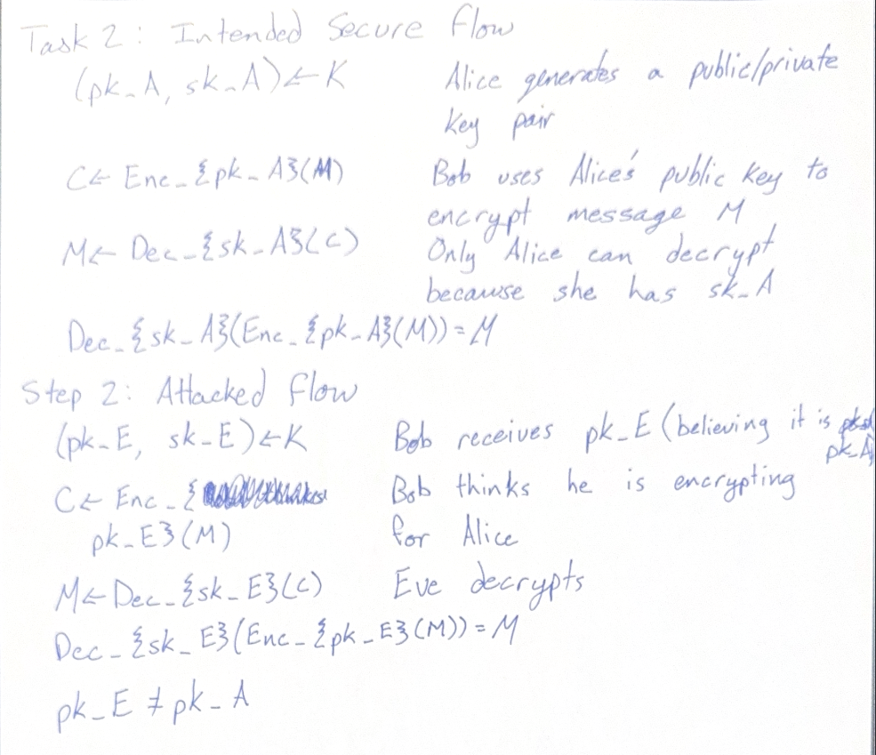
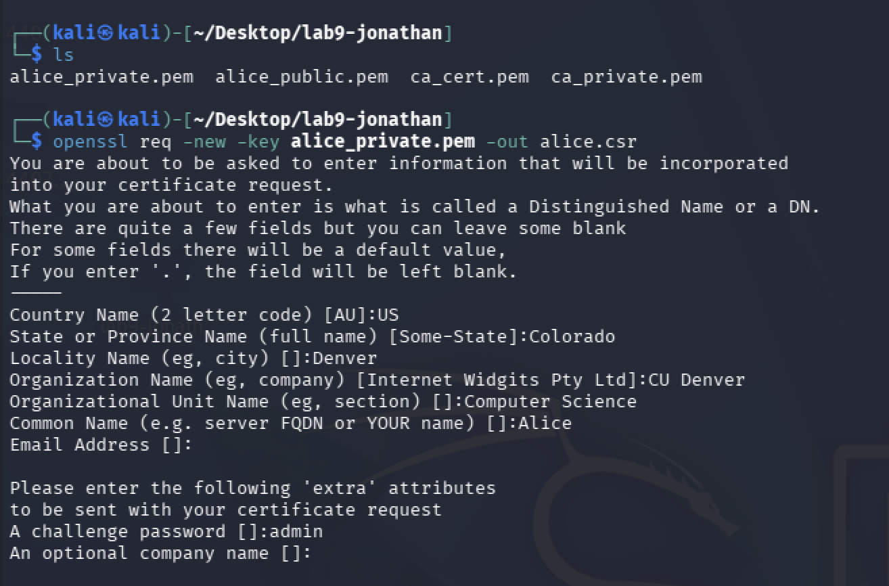
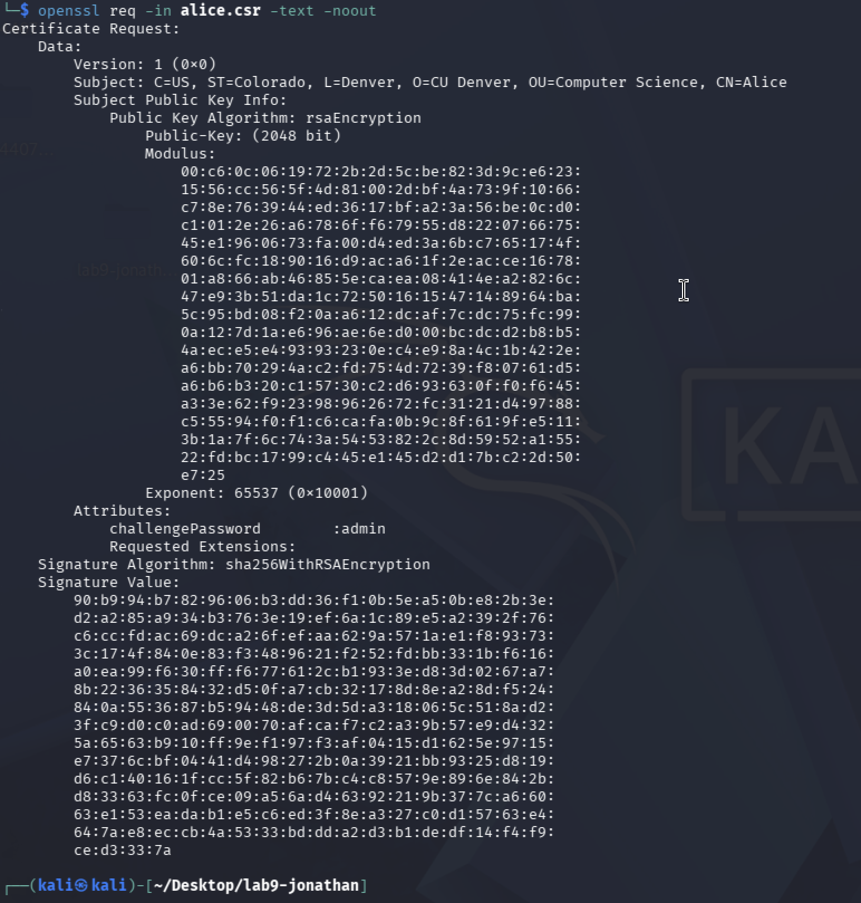
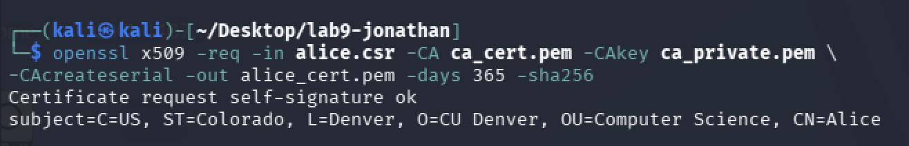
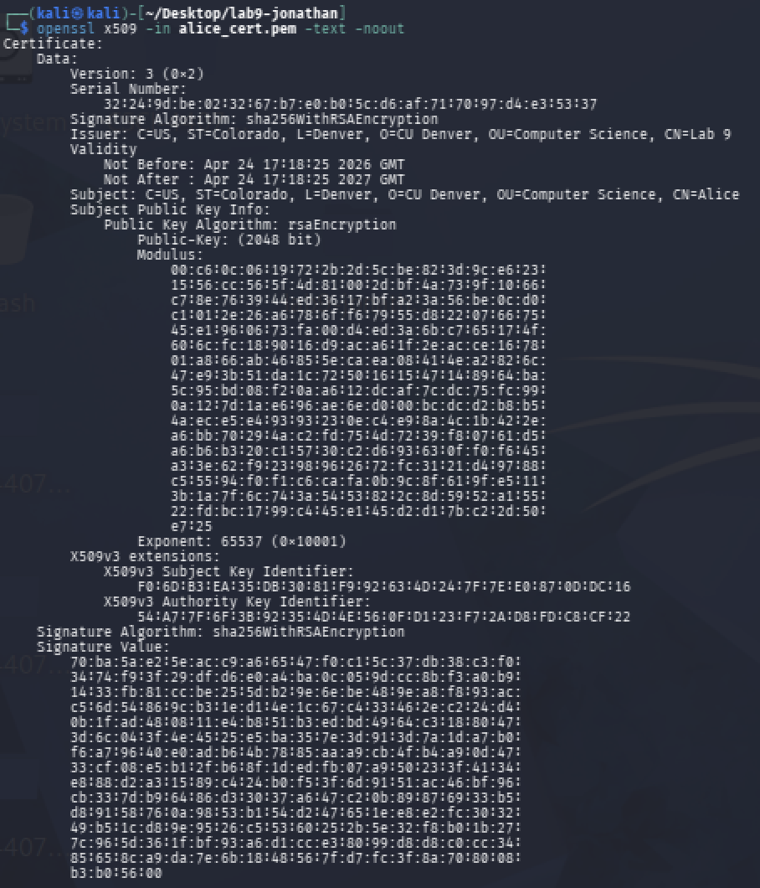
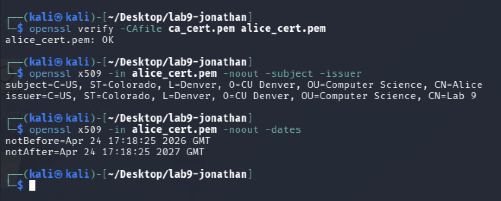
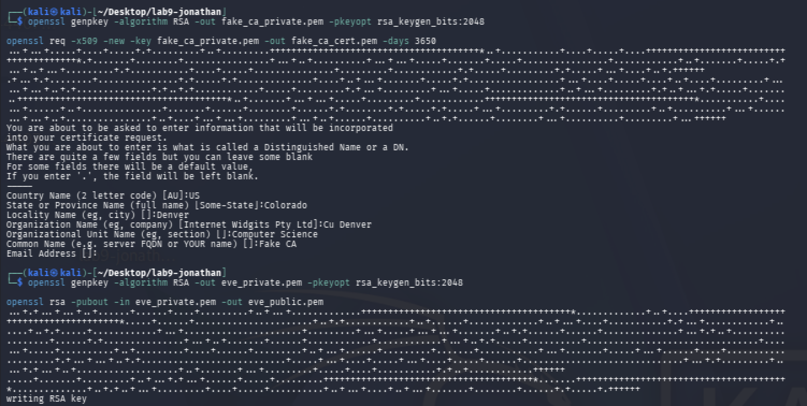
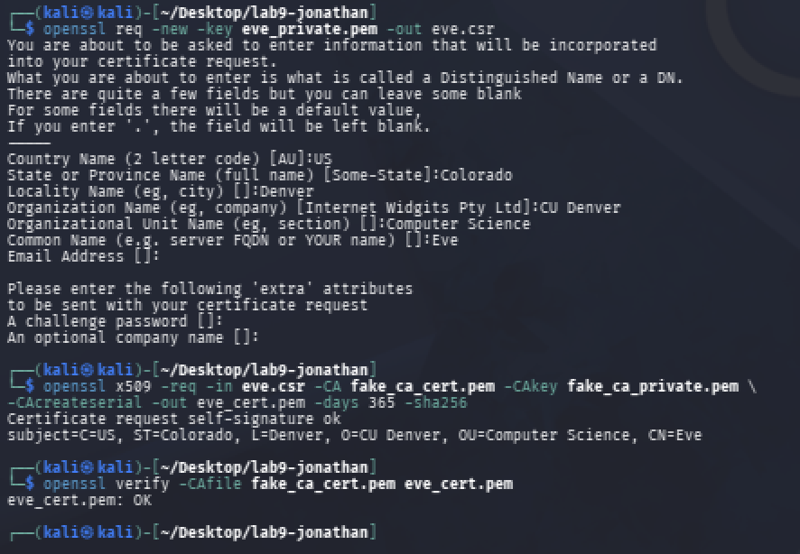
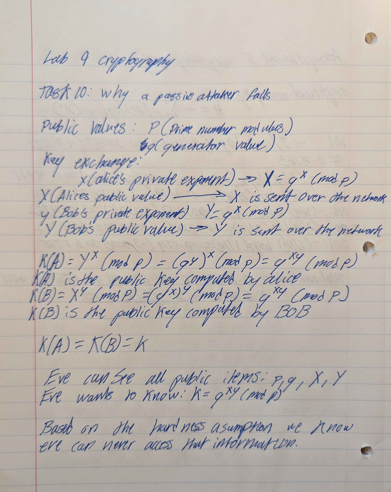

# Department of Computer Science & Engineering
## CSCI/CSCY 4407: Security & Cryptography
## Lab 9 Report: Key Distribution, PKI, MiTM & Diffie-Hellman

**Group Number:** Group 10
**Semester:** Spring 2026
**Instructor:** Dr. Victor Kebande
**Teaching Assistant:** Celest Kester
**Submission Date:** April 24, 2026

**Group Members:**
- Matthew Kenner
- Jonathan Le
- Cassius Kemp

---

## Table of Contents

1. [Introduction](#introduction)
2. [Environment](#environment)
3. [Files Included](#files-included)
4. [Task 1 – Directory and File Setup](#task-1)
5. [Task 2 – Why Keys Alone Don't Establish Trust](#task-2)
6. [Task 3 – RSA Key Generation](#task-3)
7. [Task 4 – Certificate Authority Setup](#task-4)
8. [Task 5 – Certificate Signing Request (CSR)](#task-5)
9. [Task 6 – Certificate Signing](#task-6)
10. [Task 7 – Certificate Verification](#task-7)
11. [Task 8 – Fake CA Experiment](#task-8)
12. [Task 9 – Diffie-Hellman Key Exchange (Python)](#task-9)
13. [Task 10 – Why a Passive Attacker Fails](#task-10)
14. [Task 11 – Man-in-the-Middle Attack on DH](#task-11)
15. [Task 12 – Comparison and Reflection](#task-12)

---

## Introduction <a name="introduction"></a>

This report documents the implementation and analysis performed for the Key Distribution, PKI, MiTM, and Diffie-Hellman lab. Tasks cover directory and key setup, RSA key generation, certificate authority creation, CSR generation and signing, certificate verification, fake CA experiments, Diffie-Hellman key exchange, passive eavesdropping analysis, and Man-in-the-Middle attack construction. Each task was completed in a Linux environment using OpenSSL and Python 3. The report includes commands, terminal outputs, screenshots, and interpretations for each experiment.

---

## Environment <a name="environment"></a>

All experiments were performed in a Linux environment using Kali Linux. OpenSSL was used for all PKI operations and Python 3 for the Diffie-Hellman implementation.

- **Operating System:** Kali Linux
- **Python Version:** Python 3.12
- **Terminal:** Kali Linux terminal
- **Key Tool:** OpenSSL
- **Installation:** Local Kali Linux install

---

## Files Included <a name="files-included"></a>

The following files are included in this submission:

- `dh.py` — Task 9: Diffie-Hellman key exchange implementation

---

## Task 1 – Directory and File Setup <a name="task-1"></a>

### Objective

Create the working directory structure required for the lab, populate it with message and configuration files, and confirm the environment is ready for PKI operations.

### Steps Performed

- Created the lab working directory and navigated into it
- Created subdirectories for keys, certificates, and messages
- Created required configuration and message files
- Verified the directory structure with `ls`

### Commands / Code Used

```bash
mkdir Key_Distribution_Lab
cd Key_Distribution_Lab
echo "Confidential payroll report for Alice." > msg1.txt
echo "Server backup credentials for secure transfer." > msg2.txt
echo "Session initialization data for Bob." > msg3.txt
cat msg1.txt
cat msg2.txt
cat msg3.txt
pwd
ls -l
sha256sum msg1.txt msg2.txt msg3.txt
```

### Output Evidence


### Directory Structure

| Path | Purpose |
|------|---------|
| `Key_Distribution_Lab/` | Root working directory for all lab files |
| `Key_Distribution_Lab/msg1.txt` | Sample confidential payroll message |
| `Key_Distribution_Lab/msg2.txt` | Sample server credentials message |
| `Key_Distribution_Lab/msg3.txt` | Sample session initialization message |

### Explanation

Having concrete files like `msg1.txt` through `msg3.txt` makes it easier to reason about what an attacker actually gains when key trust fails. These aren't abstract placeholders — they represent payroll data, credentials, and session info, the kind of content that has real consequences if it ends up in the wrong hands. If Eve ends up holding the decryption key instead of Alice (as in Task 2), she can read these files in full. The SHA-256 hashes also give us a baseline to detect any modification to the messages during the lab.

---

## Task 2 – Why Keys Alone Don't Establish Trust <a name="task-2"></a>

### Objective

Reason through why distributing a raw public key is insufficient to establish trust, and identify what is missing.

### Steps Performed

This is a **pen-and-paper reasoning task**. No commands were run.

- Considered the scenario: Alice distributes her public key directly to Bob
- Identified the attack: Eve intercepts and substitutes her own public key
- Explained what a Certificate Authority adds to solve this

### Evidence



### Explanation

Bob thinks he's encrypting for Alice, but since there's no authentication on the public key he received, he has no way to verify it actually belongs to her. Eve intercepts Alice's key, substitutes her own, and Bob unknowingly encrypts everything under Eve's key. Eve decrypts it, reads it, optionally modifies it, re-encrypts it with Alice's real key, and forwards it along. Neither side notices anything wrong because the encryption itself works fine — the failure is entirely in authenticity, not in the algorithm. Public availability of a key is not the same as proof of who it belongs to, which is exactly the gap a Certificate Authority closes.

---

## Task 3 – RSA Key Generation <a name="task-3"></a>

### Objective

Generate an RSA private key and derive the corresponding public key, producing the key material that will be used throughout the PKI tasks.

### Steps Performed

- Generated a 2048-bit RSA private key using OpenSSL
- Derived and exported the public key
- Inspected both key files to confirm structure

### Commands / Code Used

```bash
openssl genpkey -algorithm RSA -out alice_private.pem -pkeyopt rsa_keygen_bits:2048
openssl rsa -pubout -in alice_private.pem -out alice_public.pem
ls -l alice_private.pem alice_public.pem
openssl pkey -in alice_private.pem -text -noout
openssl rsa -pubin -in alice_public.pem -text -noout
```

### Output Evidence


### Key Details

| Property | Value |
|----------|-------|
| Key type | RSA |
| Key size (bits) | 2048 |
| Private key file | `alice_private.pem` |
| Public key file | `alice_public.pem` |

### Explanation

The private key (`alice_private.pem`) must stay secret — it's what Alice uses to decrypt or sign, and if it leaks, everything built on top of it is compromised. The public key (`alice_public.pem`) can be freely shared since it only lets others encrypt to Alice or verify her signatures. That said, just having this key pair doesn't solve the distribution problem. Bob still has no way to verify that a file claiming to be Alice's public key actually belongs to her — it's just bytes on disk without any binding to an identity. That's what the next tasks address.

---

## Task 4 – Certificate Authority Setup <a name="task-4"></a>

### Objective

Create a self-signed Certificate Authority (CA) certificate that will be used to sign and validate all subsequent certificates in the lab.

### Steps Performed

- Generated a private key for the CA
- Created a self-signed CA certificate using OpenSSL
- Inspected the CA certificate to confirm its issuer and subject fields are identical (self-signed)

### Commands / Code Used

```bash
openssl genpkey -algorithm RSA -out ca_private.pem -pkeyopt rsa_keygen_bits:2048
openssl req -x509 -new -key ca_private.pem -out ca_cert.pem -days 3650
openssl x509 -in ca_cert.pem -text -noout
ls -l ca_private.pem ca_cert.pem
```

### Output Evidence


### CA Certificate Details

| Field | Value |
|-------|-------|
| Subject | C=US, ST=Colorado, L=Denver, O=CU Denver, OU=10, CN=Group 10 |
| Issuer | C=US, ST=Colorado, L=Denver, O=CU Denver, OU=10, CN=Group 10 |
| Valid From | Apr 24 04:00:40 2026 GMT |
| Valid To | Apr 21 04:00:40 2036 GMT |
| Key file | `ca_private.pem` |
| Certificate file | `ca_cert.pem` |

### Explanation

A CA's job is to vouch for the binding between a public key and an identity. In this lab we created our own self-signed root CA, which means the Subject and Issuer fields in `ca_cert.pem` are identical — there's no higher authority above it, so it signs itself. In a real deployment, root CAs are trusted because their certificates are already embedded in browsers and operating systems by the vendor; trust has to be anchored somewhere. We use 2048-bit RSA because it meets the current industry standard for security margin — below 2048 bits is considered weak by modern standards, and for a CA that may sign many certificates over 10 years, anything weaker would be inappropriate.

---

## Task 5 – Certificate Signing Request (CSR) <a name="task-5"></a>

### Objective

Generate a Certificate Signing Request (CSR) for an entity whose identity needs to be certified by the CA.

### Steps Performed

- Used the existing private key from Task 3
- Created a CSR containing the entity's public key and identity information
- Inspected the CSR to confirm its contents

### Commands / Code Used

```bash
openssl req -new -key alice_private.pem -out alice.csr
openssl req -in alice.csr -text -noout
ls -l alice.csr
```

### Output Evidence





### CSR Details

| Field | Value |
|-------|-------|
| Subject | C=US, ST=Colorado, L=Denver, O=CU Denver, OU=Computer Science, CN=Alice |
| Key file | alice_private.pem |
| CSR file | alice.csr |

### Explanation

What was done:
For this step, we created a Certificate Signing Request (CSR) using Alice’s private key. The CSR is basically a request sent to the Certificate Authority (CA) asking for a certificate. It includes Alice’s identity information (like name and organization), her public key, and a digital signature created using her private key.

What information is included in a CSR:
The CSR contains three main things: the subject identity (Common Name, organization, etc.), the public key, and a digital signature. The signature is important because it proves that the person creating the request actually owns the private key associated with that public key.

What happened:
When we ran the OpenSSL command, it generated the alice.csr file. When inspecting it using openssl req -text, we could see the subject information we entered and the public key that will be certified. The private key is not included in the CSR, which is important for security.

Why the CA does not sign arbitrary public keys:
The CA does not just sign any public key it receives, because that would allow attackers to create certificates for identities they don’t actually own. Instead, the CA relies on the information in the CSR and would normally verify the identity before signing it.

Why proof of possession matters:
The digital signature inside the CSR proves that the requester actually has the private key. This prevents someone from submitting a public key they don’t control. Without this proof, an attacker could request a certificate for someone else’s identity and break the trust model.

Why it matters overall:
The CSR is an important step in PKI because it connects a real identity to a public key in a secure way. It ensures that only the rightful owner of a key can request a certificate, which helps prevent impersonation and supports secure communication.

---

## Task 6 – Certificate Signing <a name="task-6"></a>

### Objective

Have the CA sign the CSR from Task 5, producing a certificate that binds the entity's public key to its identity under the CA's authority.

### Steps Performed

- Used the CA private key and certificate (from Task 4) to sign the CSR
- Produced a signed certificate for the entity
- Inspected the resulting certificate to confirm the Subject and Issuer fields

### Commands / Code Used


```bash
openssl x509 -req -in alice.csr -CA ca_cert.pem -CAkey ca_private.pem \
-CAcreateserial -out alice_cert.pem -days 365 -sha256

openssl x509 -in alice_cert.pem -text -noout
```

### Output Evidence




### Certificate Details

| Field | Value |
|-------|-------|
| Subject | C=US, ST=Colorado, L=Denver, O=CU Denver, OU=Computer Science, CN=Alice |
| Issuer | C=US, ST=Colorado, L=Denver, O=CU Denver, OU=10, CN=Group 10 |
| Valid From | Apr 24 17:18:25 2026 GMT |
| Valid To | Apr 24 17:18:25 2027 GMT |
| Signed by | ca_cert.pem |

### Explanation

What was done:
In this step, we used the CA’s private key and certificate to sign Alice’s CSR and generate a digital certificate. This process takes the information from the CSR and produces a signed certificate that can be verified by others who trust the CA.

What happened:
After running the command, a new file called alice_cert.pem was created. When inspecting the certificate, we can clearly see that the Subject field contains Alice’s identity, while the Issuer field contains the CA’s information. This shows that the CA has signed Alice’s certificate instead of it being self-signed.

What exactly the CA is asserting:
By signing the certificate, the CA is confirming that the public key inside the certificate belongs to Alice. It is essentially acting as a trusted third party that verifies and vouches for Alice’s identity.

Why this is better than sending a raw public key:
If Alice just sent her public key directly, an attacker could replace it with their own key without being detected. However, with a signed certificate, the public key is tied to Alice’s identity through the CA’s signature. This makes it much harder for an attacker to perform a key substitution attack.

Why this helps establish trust:
If another user (like Bob) trusts the CA, they can verify Alice’s certificate using the CA’s public key. Once verified, Bob can be confident that the public key actually belongs to Alice and has not been tampered with.

---

## Task 7 – Certificate Verification <a name="task-7"></a>

### Objective

Verify the signed certificate from Task 6 using the CA certificate, confirming the full chain of trust from entity to CA.

### Steps Performed

- Used OpenSSL to verify the entity certificate against the CA certificate
- Confirmed that the verification command returns success
- Inspected the verification output

### Commands / Code Used

```bash
openssl verify -CAfile ca_cert.pem alice_cert.pem
openssl x509 -in alice_cert.pem -noout -subject -issuer
openssl x509 -in alice_cert.pem -noout -dates```
```

### Output Evidence


### Verification Result

| Item | Value |
|------|-------|
| CA certificate used | ca_cert.pem |
| Certificate verified | alice_cert.pem |
| Verification result | OK |

| Field | Value |
|------|------|
| Subject | C=US, ST=Colorado, L=Denver, O=CU Denver, OU=Computer Science, CN=Alice |
| Issuer | C=US, ST=Colorado, L=Denver, O=CU Denver, OU=10, CN=Group 10 |
| Valid From | Apr 24 17:18:25 2026 GMT |
| Valid To | Apr 24 17:18:25 2027 GMT |

### Explanation

What was done:
In this step, we verified Alice’s certificate using the CA certificate that we created earlier. This checks whether the certificate was actually signed by the CA and whether it can be trusted.

What happened:
The verification command returned OK, which means the certificate is valid and was successfully verified using the CA’s public key. We also checked the subject, issuer, and validity dates to confirm that the certificate contains the expected information.

Why verification depends on a trusted CA:
Certificate verification only works if the CA used is trusted. In this case, we used our own CA certificate, so the verification succeeded. If we used a different or untrusted CA, the verification would fail.

Why a certificate being valid is not enough:
A certificate can be mathematically valid, but that doesn’t mean it should be trusted. Trust depends on which CA signed the certificate. If the CA is not trusted, the certificate should not be accepted.

Why validity dates matter:
The certificate includes a start date and an expiration date to limit how long it is considered valid. This helps reduce risk if a key is compromised, since the certificate will eventually expire and need to be replaced.

---

## Task 8 – Fake CA Experiment <a name="task-8"></a>

### Objective

Demonstrate that trust is anchored entirely to the CA by creating a fake CA, signing a certificate with it, and showing that the fake certificate is accepted by the fake CA but rejected by the real CA.

### Steps Performed

- Generated a new fake CA key and self-signed certificate
- Signed a new entity certificate using the fake CA
- Verified the fake entity certificate against the **fake CA** — expected: success
- Verified the fake entity certificate against the **real CA** — expected: failure

### Commands / Code Used

```bash
openssl genpkey -algorithm RSA -out fake_ca_private.pem -pkeyopt rsa_keygen_bits:2048
openssl req -x509 -new -key fake_ca_private.pem -out fake_ca_cert.pem -days 3650

openssl genpkey -algorithm RSA -out eve_private.pem -pkeyopt rsa_keygen_bits:2048
openssl rsa -pubout -in eve_private.pem -out eve_public.pem

openssl req -new -key eve_private.pem -out eve.csr

openssl x509 -req -in eve.csr -CA fake_ca_cert.pem -CAkey fake_ca_private.pem \
-CAcreateserial -out eve_cert.pem -days 365 -sha256

openssl verify -CAfile fake_ca_cert.pem eve_cert.pem
openssl verify -CAfile ca_cert.pem eve_cert.pem

```

### Output Evidence



### Verification Results

| Scenario | Certificate | CA Used | Result |
|----------|-------------|--------|--------|
| Fake CA verification | eve_cert.pem | fake_ca_cert.pem | OK |
| Real CA verification | eve_cert.pem | ca_cert.pem | FAILED |

### Explanation

What was done:
In this step, we created a fake Certificate Authority (CA) and used it to sign a certificate for Eve. We then verified the certificate using both the fake CA and the real CA to compare the results.

What happened:
When verifying Eve’s certificate using the fake CA, the result returned OK, meaning the certificate was valid under that CA. However, when verifying the same certificate using the real CA, the verification failed. This shows that the certificate is only trusted when using the CA that signed it.

Why a certificate can be valid under one CA but not another:
A certificate’s validity depends on the CA used during verification. Even though the certificate is correctly signed, it will only be accepted if the verifier trusts the CA that signed it. If a different CA is used, the signature cannot be verified, and the certificate is rejected.

Why the CA is the real trust anchor:
This experiment shows that the CA’s public key is the root of trust in a PKI system. If a user trusts the wrong CA, they can be tricked into accepting malicious certificates.

Connection to real-world attacks:
This is similar to real-world scenarios where attackers install fake root certificates on a system or use compromised CAs to issue fraudulent certificates. In these cases, the system may incorrectly trust malicious certificates, allowing attackers to intercept secure communications.

---

## Task 9 – Diffie-Hellman Key Exchange (Python) <a name="task-9"></a>

### Objective

Implement and run the Diffie-Hellman key exchange in Python to demonstrate how two parties can arrive at a shared secret over a public channel without ever transmitting that secret.

### Steps Performed

- Ran the provided DH script with the original values (`x=6`, `y=15`)
- Modified `x`, `y` and ran again
- Confirmed that both runs produce matching shared keys on both sides

### Commands / Code Used

```bash
python3 dh_demo.py
```

```python
# dh_demo.py

p = 23 #A small prime number (aka the modulus)
g = 5  #The generator

#Alice's secret exponent
x = 6

#Bob's secret exponent
y = 15

#Public values (These are what we are sending over the network)
X = pow(g, x, p)
Y = pow(g, y, p)

#Shared keys
KA = pow(Y, x, p)
KB = pow(X, y, p)

print("--- Public Parameters (Visible to everyone) ---")
print("Public prime p =", p)
print("Generator g =", g)

print("\n--- Secret Values (Never transmitted) ---")
print("Alice secret x =", x)
print("Bob secret y =", y)

print("\n--- Transmission (Visible to Eve) ---")
print("Alice sends X = g^x mod p =", X)
print("Bob sends Y = g^y mod p =", Y)

print("\n--- Final Calculation ---")
print("Alice computes KA = Y^x mod p =", KA)
print("Bob computes KB = X^y mod p =", KB)
print("Same key?", KA == KB)
```

### Output Evidence

  


### Recorded Values

| Run | p | g | Alice private (x) | Bob private (y) | Alice public (X) | Bob public (Y) | Shared key | Match? |
|-----|---|---|-------------------|-----------------|-----------------|----------------|------------|--------|
| 1 | 23 | 5 | 6 | 15 | 8 | 19 | 2 | True |
| 2 | 23 | 5 | 9 | 12 | 11 | 18 | 12 | True |

### Explanation

**Why Alice and Bob obtain the same key?**   
They obtain the same key because of the mathematical properties of exponents (g^x)^y = g^xy = (g^y)^x. We can see that by raising the received public value to a user's own private exponent, both parties are able to compute g^xy (mod p) to obtain the same key.  

**Why the exchanged public values are not enough to reveal the private exponents?**   
The public values (X and Y) are calculated using modular arithmetic (also known as clock math). An attacker is able to see X=8, through this they know 5x(mod23)=8. To find x, the attacker must be able to solve the Discrete Logarithm Problem and while this is easy for our toy example (p=23), if p is a 2048-bit prime number then reversing this operation is computationally impossible for the lifetime of a human using modern computers.  

**Why this is educational and not suitable for real deployment?**   
This script uses small values (p=23), so this means that an attacker could just guess every possible value of x (from 1 to 22) in a fraction of a millisecond and find the data that they need. Real world deployments on the other hand use massive prime numbers (e.g., 2048-bit or 4096-bit numbers) to ensure the discrete logarithm problem remains unsolvable by modern technology.  

---

## Task 10 – Why a Passive Attacker Fails <a name="task-10"></a>  

### Objective  

Reason through — without code — why an attacker who only observes the Diffie-Hellman public values cannot compute the shared secret.  

### Steps Performed  

No commands were run for this task (pen and paper).  

- Identified what a passive attacker can observe: `p`, `g`, `X = g^x mod p`, `Y = g^y mod p`  
- Explained why recovering `x` or `y` from these values is computationally infeasible  
- Confirmed the attacker cannot compute `g^(xy) mod p` without knowing `x` or `y`  

### Evidence  



Public Parameters:  
  - p (Prime number modulus)  
  - g (The generateor value)  
    
Key Exchange:
 - x (Alice's random private exponent)  
 - X = g^x (mod p) (Alice's computed public value)   
 - X is then sent over the network  
 - y (Bob's random private exponent)  
 - Y = g^x (mod p) (Bob's computed public value)  
 - Y is the sent over the network  
   
Shared Secret Calculation:  
 - Y is recieved by Alice, then the key is computed:    
        K(A) = Y^x  (mod p) = (g^y)^x  (mod p) = g^xy  (mod p)  
   
 - X is recieved by Bob, then the key is computed:  
        K(B) = X^y  (mod P) = (G^x)^y  (mod p) = g^xy  (mod p)  

This structure implies that K(A) = K(B) = K.  

What the adversary (eve) can see:  
- Eve is able to see the public items: p,g,X,Y  
- Eve wants to know what the key is: K = g^xy (mod p)    
Hardness Assumption: We can assume that if eve wants to find K, they must be able to x or y. However, we know that this is not possible through means of calculation as to find y from Y = g^y (mod p) we would have to be able to break the Discrete Logarithm Problem. As mentioned before this is not feasible by any current humans means.  

### Key Equations  

| Value | Known to Attacker? |  
|-------|-------------------|  
| `p` (prime modulus) | Yes — public knowledge |  
| `g` (generator) | Yes — public knowledge |  
| `X = g^x mod p` | Yes — Is transmitted publicly |  
| `Y = g^y mod p` | Yes — Is transmitted publicly |  
| `x` (Alice's private key) | No — requires solving the Discrete Logarithm Problem |  
| `y` (Bob's private key) | No — requires solving the Discrete Logarithm Problem |  
| `g^(xy) mod p` (shared key) | No — cannot derive without finding `x` or `y`, this is not possible |  

### Explanation  

Describe the passive adversary model:    
A passive adversary (Typically known as Eve) acts in a manner that similar to that of a wiretap. They can intercept, record, and observe every single bit of data transmitted over the network between Alice and Bob at any time as long as Eve is connected and listening. However, they do not have the ability to alter data, drop packets, or inject their own messages into the communication stream. This means that the main target of Eve is to collect data and from that data derive keys or other important data so that they can engage in further attacks. This is not typically what the goal of a man in the middle attack, as MITM is mostly just for data collection.  

Why the shared secret remains hidden:    
In the Diffie Hellman exchange we know and gurantee that the actual shared secret (K=g^xy (mod p)) is never transmitted however, we do know that all public data is at some point transmitted. This means that Eve is only able to observe the public parameters (p and g) and the public keys (X = g^x and Y = g^y). Since the Diffie Hellman computational assumption holds true for large groups of data, it means that Eve cannot efficiently calculate g^xy just by knowing g^x or g^y. Therefore, the final symmetric key remains completely hidden from them as it is computationally impossible for Eve to derive this data in a lifetime with modern technology.  

Relate to Python script:    
In the python script above that we made we know that Eve is able to see p=23, g=5, X=8, Y=19. Without knowing either x=6 or y=15, they cannot easily determine what the final key K(A) and K(B) will equal to. In our script the Final key on the first round is 2 and on the second round is 12, these 2 keys are completely safe from Eve but are able to be used by Alice and Bob without worry.  

Why observing X and Y is different from knowing x and y:  
X and Y are the outputs of a one-way modular function, this makes the operation non linear and saves the data from being found. Knowing this result does not allow an attacker to easily find the inputs (x or y) due to the hardness assumption from the Discrete Logarithm Problem. This provides a safety net for these two values and therfore keeps the keys safe as well.  

Why DH is useful against eavesdropping but not yet authenticated:  
Diffie Hellman is able to very effectively solve the problem of establishing a shared secret over an open channel without engaging in the pre sharing process of any keys, this makes passive eavesdropping nearly impossible. However, the math we see here provides absolutely no proof of identity from either side which can lead to issues down the line. Alice knows that they established a secure key with someone, but the math cannot prove that the "someone" is actually Bob. It is possible that if Eve where to somehow intercept a Key they can start communication with either Alice or Bob and begin an attack from here.  

---

## Task 11 – Man-in-the-Middle Attack on DH <a name="task-11"></a>  

### Objective  

Construct a step-by-step Man-in-the-Middle (MiTM) attack against unauthenticated Diffie-Hellman, showing that DH alone does not prevent an active attacker from intercepting and controlling the shared keys.  

### Steps Performed  

No commands were run for this task (pen and paper).  

- Described Eve's position between Alice and Bob  
- Walked through how Eve intercepts and replaces each public key  
- Showed that Alice and Bob each share a key with Eve, not each other  
- Explained why neither Alice nor Bob can detect the attack without authentication  

### Evidence    

Alice generates her secret x, then computes X (X = g^x), and sends this computed value for X to Bob (or atleast it was intended for Bob).  

Eve (Our Active Attacker) intercepts the X that Alice has sent for Bob. Eve then generates her own secret this is called z, they then compute the value for E (E = g^z), and sends E to Bob then pretending E is X from Alice.  

Bob generates his secret y, then computes Y (Y = g^y), and sends this computed value for Y to Alice (intended for Alice).   

Eve then intercepts Y. She sends their own value of E (E = g^z) to Alice, pretending that it came from Bob.  

Alice then receives E, and they compute the shared key, K(AE) = E^x = (g^z)^x = g^zx (mod p). Bob also receives E and they compute the shared key, K(EB) ​= E^y = (g^z)^y =g^zy (mod p).   

Eve knows their own secret (Z) so eve is able to compute both of the key from Alice and Bob, K(AE) = X^z = (g^x)^z = g^xz (mod p) and K(EB) = Y^z = (g^y)^z = g^yz (mod p).  

Explain the deception:   
Alice computed their key (K(AE)) and believes that they shared their key securely with Bob. Bob computed their key (K(EB)) and believes that they shared it securely with Alice. What actually happened, Alice and Bob shared no keys with each other as their keys were intercepted by Eve, and from here Eve sent keys to both Alice and Bob to fool them into believing the process was completed sucessfully.   

Explain what Eve can do:   
Because Eve possesses both K(AE) and K(EB), they can engage decryption and data modification techniques. Eve with the keys can decrypt all messages between bob and alice using the key needed to decrypt the message. With the message now decrypted Eve can see the plaintext message and from here can both read the message or modify the contents of the message if they so desire. Once Eve has done what they want with the message they then Re-Encrypt the message and send it to whom ever it was destined for, and the reciever will decrypt the message and assume that it is an authentic message from the assumed sender.  

Alice (sends message to Bob) -> Eve (decrypts the message) -> Eve (reads or modifies the message -> Eve (reencrypts the message) -> Eve (sends message to bob) -> Bob (decrypts the message) -> Bob (assumes message came from Alice)    

Process repeats but from Bob to Alice.  

Why the attack is possible: 
The attack is possible due to the Diffie-Hellman exchange lacking any form authentication. Alice accepted the value E without requiring any cryptographic proof (like a digital signature) that the value actually originated from Bob. The exponentiation is actually secure but with no authentication it cannot be considered secure, as it can be faked by an adversary.  

Why authenticated key exchange protocols are necessary: 
Without authentication, you cannot put any trust in the mathematical security of the channel as the keys can be faked at any point durin the communication. Modern protocols (like TLS) solve this by requiring the server to digitally sign its Diffie Hellman's public parameters (X or Y) using its private RSA key. The client then verifies that signature is legitimate using the server's PKI certificate before accepting the key as a true genuine key from the destination they are trying to communicate with.  

### Attack Flow as a Table  

| Step | Actor | Action |
|------|-------|--------|
| 1 | Alice | Sends public key `X = g^x mod p` to Bob |  
| 2 | Eve | Intercepts `X`; sends her own `E = g^z mod p` to Bob |  
| 3 | Bob | Sends public key `Y = g^y mod p` to Alice |  
| 4 | Eve | Intercepts `Y`; sends her own `E = g^z mod p` to Alice |  
| 5 | Alice | Computes shared key with `E` — believes she's talking to Bob |  
| 6 | Bob | Computes shared key with `E` — believes he's talking to Alice |  
| 7 | Eve | Holds both shared keys; decrypts, reads, re-encrypts all traffic | 

---

## Task 12 – Comparison and Reflection <a name="task-12"></a>  

### Objective  

Synthesize all experimental results into a structured comparison and reflection, articulating the security properties, limitations, and real-world roles of each mechanism explored in this lab.  

### Comparison Table  

| Mechanism | Authentication | Passive Eavesdropper Protection | Man in The Middle Protection |  
|-----------|--------|-------------|---------------|  
| Raw Public Key | None - simply asks for a key | No | No - Eavesdropper can forge a key and conduct a MITM Attack |  
| PKI / CA Certificates | Yes - Certificate is signed by the CA | Yes | Yes - The signature is not able to be forged from the CA |  
| Diffie-Hellman (unauthenticated) | None — no identity verification | Yes — discrete log problem prevents passive key recovery | No — vulnerable to active attacker substituting public keys (Task 11) |  
| Authenticated DH (DH + PKI) | Yes — PKI certificates verify identity of each party | Yes — DH key computation hides the shared secret | Yes — PKI signatures prevent key substitution |  
| TLS (PKI + ephemeral session keys) | Yes - PKI provides authentication protection over the Diffie Hellman Key exchange | Yes - Diffie Hellman hides the key | Yes - PKI signatures prevent key forgery |  

---

### Long Lived Keys
Long lived keys (also known as static or long life keys) are cryptographic keys designed to remain valid and secure over an extended period of time, often years or decades (already doesn't sound secure). Their primary purpose is authentication and identity verification, rather than the encryption of any kind of data. Because generating, certifying, and distributing these keys is a rigorous and slow process, they are designed and intended to be set up once and used many times over and over.  

Examples of these long lived keys include:  

  An RSA private key: Used to digitally sign documents or authenticate to a network (like an SSH key).  

  A server's certificate private key: Held securely by a web server (like an HTTPS site) to prove its identity to visiting browsers.  

  A trusted CA root key: A very important long lived key type, often kept completely offline in highly secure systems (typically called Vaults). They are used exclusively to sign the certificates of intermediate authorities (AKA the Certificate Authority).  

  A long term shared secret: Used in specialized systems like Kerberos or pre shared key VPN setups where devices have a static and hardcoded passwords used to authenticate.  

### Session Keys  

A session key is a temporary type of cryptographic key that is generated exclusively for a singular communication session. Unlike the long lived keys, session keys are usually symmetric (like an AES key) and are generated on a when needed basis as two parties connect to each other. They are used to encrypt the actual data that is to be transmitted during that specific interaction and are deconstructed/destroyed securely by both parties the moment the session is ended or the key lifecycle times out.  

#### Session key preference  

Real world systems rarely use long-lived keys to encrypt any amounts of data they instead choose to use long-lived keys to authenticate the creation of a session key to encrypt this data. This architecture is preferable for several reasons, Long-lived keys typically rely on asymmetric algorithms (like RSA keys) and these algorithms involve complex mathematical operations on massive number sets (2048-bit modular exponentiation, etc.). These algorithms are orders of magnitude slower than what is needed for encrypting something like a real time video, a transfer of large files, or general web browsing. Session keys however, use a symmetric algorithm (like AES keys) and these algorithms are incredibly fast and make use of hardware acceleration to encrypt traffic in real time. If an attacker records encrypted network traffic for as much time as needed and eventually manages to steal a server's long lived private key, they still are not able to go back and decrypt the old traffic if session keys were used in the communication. This is because a unique session key was generated (Using Diffie Hellman) and then was destroyed during the duration session, a long lived key getting compromised does not compromise the entire system and keeps the integrity of the old confidentiality. If a long lived key had been used for encryption of the data then all of the historical data would be instantly exposed. Using separate keys for each session enforces a clean structural boundary, as asymmetric keys handle the heavy lifting of proving who you are through authentication, while the symmetric keys handle the heavy lifting of protecting our data through encryption. Relying on session keys allows for quick and often key rotation whereas during a long lived connection (like a VPN tunnel that may stay open for days), the protocol can automatically configure a new session key every hour. This limits the amount of ciphertext an attacker can gather under a single key and therefore significantly reduces the viability of mathematical cryptanalysis.

### Reflection

Throughout this lab we came to the realization that robust mathematical encryption algorithms are entirely useless if the key distribution process is flawed (like missing authentication). Key distribution is far harder than it first appears because ensuring confidentiality over an open network does not automatically ensure authenticity, as you may be communicating perfectly securely with an active attacker performing something like a MITM attack. Public key cryptography, while it solves the problems poised by the pre sharing of a key, it still requires absolute authenticity and this weakness is a massive exploit. If Bob receives Alice's raw public key over the internet, he has no mathematical guarantee that the key wasn't forged by Eve during transit. This is why Public Key Infrastructure (PKI) is essential for data integrity, as PKI shifts the burden of trust from individual key exchanges to a hierarchical system anchored by a globally trusted Certificate Authority (CA) therefore allowing Bob to verify Alice’s identity via the CA's unforgeable digital signatures. Similarly, the Diffie Hellman tests showed us that while the algorithm effectively establishes a shared secret that is immune to passive eavesdropping, its lack of inherent authentication renders it immensely vulnerable to Man in the Middle attacks. An active attacker can simply work with separate secure channels with both parties and mimic secure traffic. This vulnerability shows why modern protocols such as TLS, rely exclusively on authenticated session key before establishing a connection between users. By using long lived PKI certificates to digitally sign the Diffie Hellman parameters during the handshake, modern systems are capable of perfectly merging the verifiable identity of asymmetric cryptography with the high speed forward secure encryption of symmetric session keys aloowing us to achieve true secure communication.

---
